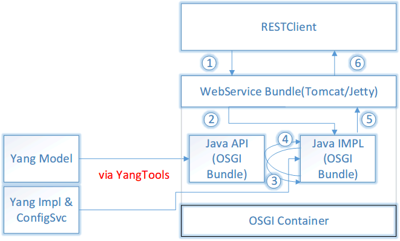

# Yang介绍
## 1 Yang基本概念 

### 1.1 什么是Yang？
* 数据建模语言
* 对NetConf的配置和状态数据、RPC和Notification建模
* 详细介绍参见[RFC6020](https://tools.ietf.org/html/rfc6020)


**数据建模语言**

* 建模语言区别于编程语言。编程语言通常是编译或解释后可直接运行的，如C/C++、Java、JavaScript等。

* 建模语言用于对某个领域进行建模。如UML可以方便的对类的继承和聚合关系建模。建模语言通常是不能编译运行的。

* 数据建模语言是针对数据的结构建模。为了更好的理解Yang是什么，可以和XML Schema类比。XML Schema是一种结构性描述，用于说明XML文件的格式。而Yang则是用来说明NetConf协议承载的数据格式。

Yang和XML、JSON的类比关系如下所示：

||SNMP|NETCONF|SOAP|RESTCONF|
|------|------|-----|-----|------|
|模型文件|.mib|.yang|.wsdl|.yang|
|模型语言|SMI|YANG|XSD|YANG|
|操作协议|SNMP|NETCONF|SOAP|RESTCONF|
|数据形式|BER|XML|XML|XML/JSON|
|传输协议|UDP|SSH/TCP|HTTP|HTTP|


**对NetConf的配置和状态数据、RPC和Notification建模**
* NetConf是一种网络配置协议，数据基于XML格式。详细介绍参见[RFC6241](https://tools.ietf.org/html/rfc6241)

* 确定了Yang的应用范围，主要用于对NetConf(RestConf：Web化精简的NetConf协议)的数据建模。

### 1.2 Yang模型速览

* **Yang模型示例**

烤面包机模型：
```yang
  module toaster {
    yang-version 1;

    namespace
      "http://netconfcentral.org/ns/toaster";

    prefix toast;

    import ietf-yang-types {prefix yang;}

    organization "Netconf Central";

    contact
      "Andy Bierman <andy@netconfcentral.org>";

    description
      "YANG version of the TOASTER-MIB.";

    revision "2009-11-20" {
      description
        "Toaster module in progress.";
    }


    identity toast-type {
      description
        "Base for all bread types supported by the toaster.
           New bread types not listed here nay be added in the 
           future.";
    }

    identity white-bread {
      base toast:toast-type;
      description "White bread.";
    }

    identity wheat-bread {
      base toast-type;
      description "Wheat bread.";
    }

    identity wonder-bread {
      base toast-type;
      description "Wonder bread.";
    }

    typedef DisplayString {
      type string {
        length "0 .. 255";
      }
      description
        "YANG version of the SMIv2 DisplayString TEXTUAL-CONVENTION.";
      reference
        "RFC 2579, section 2.";
    }

    container toaster {
      presence
        "Indicates the toaster service is available";
      description
        "Top-level container for all toaster database objects.";
      leaf toasterManufacturer {
        type DisplayString;
        config false;
        mandatory true;
        description
          "The name of the toaster's manufacturer. For instance, 
                Microsoft Toaster.";
      }

      leaf toasterModelNumber {
        type DisplayString;
        config false;
        mandatory true;
        description
          "The name of the toaster's model. For instance,
               Radiant Automatic.";
      }

      leaf toasterStatus {
        type enumeration {
          enum "up" {
            value 1;
            description
              "The toaster knob position is up.
                      No toast is being made now.";
          }
          enum "down" {
            value 2;
            description
              "The toaster knob position is down.
                      Toast is being made now.";
          }
        }
        config false;
        mandatory true;
        description
          "This variable indicates the current state of 
               the toaster.";
      }
      
      leaf darknessFactor {
        type uint32;
        config true;
        default 1000;
        description
          "The darkness factor. Basically, the number of ms to multiple the doneness value by.";
      }
    }  // container toaster

    rpc make-toast {
      description
        "Make some toast.
           The toastDone notification will be sent when 
           the toast is finished.
           An 'in-use' error will be returned if toast
           is already being made.
           A 'resource-denied' error will be returned 
           if the toaster service is disabled.";
      input {
        leaf toasterDoneness {
          type uint32 {
            range "1 .. 10";
          }
          default '5';
          description
            "This variable controls how well-done is the 
                   ensuing toast. It should be on a scale of 1 to 10.
                   Toast made at 10 generally is considered unfit 
                   for human consumption; toast made at 1 is warmed 
                   lightly.";
        }

        leaf toasterToastType {
          type identityref {
            base toast:toast-type;
          }
          default 'wheat-bread';
          description
            "This variable informs the toaster of the type of 
                   material that is being toasted. The toaster 
                   uses this information, combined with 
                   toasterDoneness, to compute for how 
                   long the material must be toasted to achieve 
                   the required doneness.";
        }
      }
    }  // rpc make-toast

    rpc cancel-toast {
      description
        "Stop making toast, if any is being made.
           A 'resource-denied' error will be returned 
           if the toaster service is disabled.";
    }  // rpc cancel-toast

    rpc restock-toaster {
        description
          "Restocks the toaster with the amount of bread specified.";
          
        input {
            leaf amountOfBreadToStock {
                type uint32;
                description
                  "Indicates the amount of bread to re-stock";
            }
        }
    }
    
    notification toasterOutOfBread {
      description
        "Indicates that the toaster has run of out bread.";
    }  // notification toasterOutOfStock
} 
```

* **模型概述**

示例yang模型虽然比较简单，基本上也反映了Yang模型的全貌。上述Yang模型主要包含以下几个部分：

  - 模型定义：`module`
  - 模型头信息：`yang-version`,`namespace`,`prefix`,`organization`,`contact`,`description`,`revision`
  - typedef类型：`typedef`
  - 配置或操作数据声明：`container`,`leaf`,`rpc`,`notification`

## 2 Yang模型和语法介绍
### 2.1 Yang模型主要内容
基于1.2的Yang模型概述，Yang模型主要的结构如下图所示：


正如之前所提到的，Yang用于对NetConf的配置和状态数据、RPC和Notification建模。
除去header information、imports&includes、Type definitions之外，
YANG模型的主要内容configuration&Operational data declarations和Action（RPC）&Notification declarations对应了YANG模型定义中的"NETCONF协议、NETCONF远端过程调用（RPCs）、和NETCONF通知（notification）"。

### 2.2 Yang模型语法
本文采用自顶向下的介绍方式，避免陷入太多的语言细节中。

#### 2.2.1 模型与子模型
Yang模型的基本单位为module，一个Yangmodel可以由多个子module构成。一个复杂的模块可能被拆成多个子模块。

子模块声明结构：
```yang
submodule <module-name> {
     <yang-version statement>
     // module identification
     <belongs-to statement>

     // linkage statements
     <import statements>
     <include statements>

     // meta information
     <organization statement>
     <contact statement>
     <description statement>
     <reference statement>

     // revision history
     <revision statements>

     // module definitions
     <other statements>
 }
```
* `submodule`:子模块的名称
* `belongs-to`:声明父模块名称，多个`submodule`的`belongs-to`的值可能相同
* `include`:模块和子模块之间的引用，引用其他模块要使用`import`声明。

#### 2.2.2 Yang 头信息

以toaster模型为例：
```
 module toaster {
    yang-version 1;
    namespace
      "http://netconfcentral.org/ns/toaster";
    prefix toast;
    import ietf-yang-types {prefix yang;}
    organization "Netconf Central";
    contact
      "Andy Bierman <andy@netconfcentral.org>";
    description
      "YANG version of the TOASTER-MIB.";
    revision "2009-11-20" {
      description
        "Toaster module in progress.";
    }
    ...
  }
```
截取的代码片段，即为Yang Header部分。
* `module`:标示Yang模型的名称，toaster要和Yang文件的文件名(toaster.yang)一致。
* `namespace`:唯一标示当前yang模型与其他Yang模型的不同，避免模型命名空间冲突。作用类似C++的namespace。
* `prefix`:作为namespace的简写，方便其他模型引用。
* `import`:用来导入其他的Yang模型。当一个Yang模型依赖于其他Yang模型时，可以使用import导入。当前示例中需要导入`ietf-yang-types`，对应的模型缩写为`yang`，这里就体现了prefix的作用。`import`避免相互引用。
* 模型描述信息：`organization` - 组织信息,`contact` - 联系人信息,`description` - 模型描述, 以上信息仅用于模型描述。
* `revision`:用来描述模型唯一的修订历史。

#### 2.2.3 Yang 类型
Yang模型的数据类型包含基本数据类型（Base Type）和衍生数据类型（Derived Type），衍生数据类型使用typedef定义。类似C++的基本类型和结构体/typedef类型的关系。

**基本数据类型**


**衍生数据类型**

衍生数据类型可以使用range，pattern，length等限定字段的信息，更多信息参考[RFC6020](https://tools.ietf.org/html/rfc6020)。

typedef定义百分比：
```yang
typedef percent{
  type uint16{
    range "0 .. 100";
  }

  description "Percentage";
}
```

#### 2.2.3 Yang Data Statement

Yang数据声明的内容才会实际体现在Yang的数据结构里。type和type的限制信息仅用于约束字段的类型。

以下**Yang代码**片段说明，数据声明和其他声明的区别：
```yang
typedef percent{
  ...
}

leaf percentage {
  type percent;
}
```
在实际的数据中只会有以下信息：

**JSON格式**
```json
{
  "percentage" : 50
}
```

**XML格式**
```xml
<percentage>50</percentage>
```

常用的数据声明：
  * `container`
  * `list`
  * `leaf`
  * `leaf-list`
  * `choice`
  * `grouping`
  * `uses`
  * `augment`

**container声明**

container定义内部数据节点，container的数据会出现在实际的数据中。container可以包含其他子声明，可以嵌套。类比的可以理解为c++的struct，可以自由的扩展数据格式。

container示例：
```yang
 container network {
    container topology {
      leaf topology-id {
        type uint32;
      }

      list node {
        key node-id;
        leaf node-id {
          type uint32;
        }

        leaf node-name {
          type string;
        }
      }
    }
 }
```

对应的xml:
```xml
<network>
  <topology>
    <topology-id>1</topology-id>
    <node>
      <node-id>1</node-id>
      <node-name>node-1</node-name>
    </node>
  </topology>
</network>
```

对应的JSON:
```json
{
  "network" : {
    "topology" : {
      "topology" : 1,
      "node" : [{
        "node-id" : 1,
        "node-name" : "node-1"
      }]
    }
  }
}
```

**list声明**

list与container相似，单list代表的一个列表的概念，每个list应该定义一个key，避免数据重复。

以container的示例为例，可以看出container对应的json object，而list对应的是json array。虽然都可以嵌套和组合，但是表达的数据形式是有差异的。

**leaf声明**

leaf是叶子节点，不允许包含子节点。

**leaf-list声明**

可表示多个重复的leaf节点。

leaf-list示例：
```
leaf-list domain-search {
  type string;
  description "List of domain names to search";
}
```

对应的XML数据：
```xml
 <domain-search>high.example.com</domain-search>
 <domain-search>low.example.com</domain-search>
 <domain-search>everywhere.example.com</domain-search>
```

对应的JSON数据：
```json
{
  "domain-search" : ["high.example.com","low.example.com","everywhere.example.com"]
}
```

list和leaf-list的**区别**：

* 都表示list的概念，但list允许有子节点，leaf-list不允许包含子节点
* list对应的json array每个子元素可以是object/arrary/基本数据，单leaf-list对应的json array每个子元素必须是基本的json数据。

**choices声明**
choices顾名思义，用于做分支选择。choices下由多个case分支，实际的数据结构中，只能出现其中一个分支的数据。

choices示例：
```
  container food {
     choice snack {
         case sports-arena {
             leaf pretzel {
                 type empty;
             }
             leaf beer {
                 type empty;
             }
         }
         case late-night {
             leaf chocolate {
                 type enumeration {
                     enum dark;
                     enum milk;
                     enum first-available;
                 }
             }
         }
     }
  }
```

对应XML数据：
```xml
 <food>
   <pretzel/>
   <beer/>
 </food>
```

对应JSON数据：
```json
{
  "food": {
    "pretzel" : "",
    "beer" : ""
  }
}
```

**grouping声明**
当一个符合结构在多个yang模型中都用到，可以使用grouping定义，在需要引用的地方简单的使用uses声明即可。

grouping实例：
```
module person {
  revison 2000-01-01 {...}

  grouping prop {
    leaf name {type string;}
    leaf age {type uint8;}
  }

  container male {
    uses prop;
    leaf sex {type uint8;}
    //<more info>
  }

  // other type
}
```
一个人拥有基本属性name和age，当定义多种类型的人时可能都需要这些基本信息。name和age就可以组合为grouping，当做一个可复用的结构，在需要的地方使用uses即可。

**uses声明**

见grouping声明。

**agument声明**

augment用于扩展yang模型的节点。

augment实例：
```
// interface-module.yang module
container interfaces {
     list ifEntry {
         key "ifIndex";

         leaf ifIndex {
             type uint32;
         }
         leaf ifDescr {
             type string;
         }
         leaf ifType {
             type iana:IfType;
         }
         leaf ifMtu {
             type int32;
         }
     }
 }


 // in another yang model
   import interface-module {
       prefix "if";
   }
   augment "/if:interfaces/if:ifEntry" {
       when "if:ifType='ds0'";
       leaf ds0ChannelNumber {
           type ChannelNumber;
       }
   }
```

对应的XML数据：
```
<interfaces xmlns="http://example.com/schema/interfaces"
           xmlns:ds0="http://example.com/schema/ds0">
 <ifEntry>
   <ifIndex>1</ifIndex>
   <ifDescr>Flintstone Inc Ethernet A562</ifDescr>
   <ifType>ethernetCsmacd</ifType>
   <ifMtu>1500</ifMtu>
 </ifEntry>
 <ifEntry>
   <ifIndex>2</ifIndex>
   <ifDescr>Flintstone Inc DS0</ifDescr>
   <ifType>ds0</ifType>
   <ds0:ds0ChannelNumber>1</ds0:ds0ChannelNumber>
   <ifMtu>100</ifMtu>
 </ifEntry>
</interfaces>
```


#### 2.2.4 Yang RPC声明

RPC声明用于定义RPC操作。RPC包含两个重要的子节点：
* `input` : 用于描述RPC操作的请求数据格式（可选）
* `output` : 用于描述RPC操作应答数据格式（可选）

RPC示例:
```yang
 module rock {
         namespace "http://example.net/rock";
         prefix "rock";

         rpc rock-the-house {
             input {
                 leaf zip-code {
                     type string;
                 }
             }
        }
     }
```

XML请求数据：
```
 <rpc message-id="101"
          xmlns="urn:ietf:params:xml:ns:netconf:base:1.0">
       <rock-the-house xmlns="http://example.net/rock">
         <zip-code>27606-0100</zip-code>
       </rock-the-house>
     </rpc>
```

XML应答数据：
```
     <rpc-reply message-id="101"
                xmlns="urn:ietf:params:xml:ns:netconf:base:1.0">
       <ok/>
     </rpc-reply>
```
#### 2.2.5 Yang Notification声明
Notification声明用于定义Notification操作。

Notification示例：
```
 module event {

     namespace "http://example.com/event";
     prefix "ev";

     notification event {
         leaf event-class {
             type string;
         }
         anyxml reporting-entity;
         leaf severity {
             type string;
         }
     }
 }
```

对应XML数据：
```
<notification
 xmlns="urn:ietf:params:xml:ns:netconf:notification:1.0">
 <eventTime>2008-07-08T00:01:00Z</eventTime>
 <event xmlns="http://example.com/event">
   <event-class>fault</event-class>
   <reporting-entity>
     <card>Ethernet0</card>
   </reporting-entity>
   <severity>major</severity>
 </event>
</notification>
```

## 3 Yang模型的用法
### 3.1 业界如何使用



### 3.2 TSDN当前如何使用

当前YangTools只能生成Java 的API，TSDN主要使用C++。因此不能利用YangTools带来的便利。以当前ON2020项目为例说明如何使用Yang模型。

当前使用Yang模型的步骤：
* 基于IETF模型扩展Yang模型，使用工具转换，提取Yang Tree
* 根据Yang Tree定义出对应的资源操作URL和交互的JSON数据格式
* TSDN北向在请求解析和应答的过程中做数据格式适配，对外体现的JSON数据与扩展的Yang模型保持一致